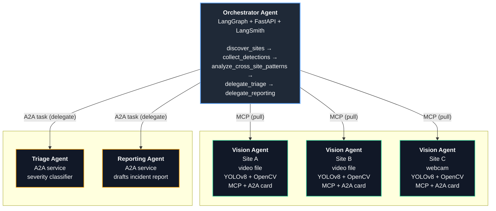

# Argus Grid

## What this is

A team of AI "agents" that watches construction sites for safety violations
(missing hard hats and safety vests) — and, more importantly, notices when
the *same* problem is happening across *multiple* sites at once, not just
one camera flagging one worker.

## The problem it solves

- A camera watching one site can tell you "someone here isn't wearing a
  hard hat right now." That's useful, but limited.
- It can't tell you "this is happening at three sites this week" — because
  it only ever sees its own site.
- A single bigger AI watching everything at once doesn't reflect how real
  safety operations actually work: local staff observe, a manager looks for
  patterns, and specialists get looped in when something's serious.

## How it works, in plain terms

1. **Local watchers** — one AI agent per site, each watching its own video
   feed for missing hard hats or vests.
2. **A site manager** — a central agent that checks in with every site,
   collects what they've seen, and asks: "is this one isolated incident, or
   the same violation showing up everywhere?"
3. **A safety officer** — when a real pattern is found, it's handed off to
   a specialist agent whose only job is to judge how serious it is.
4. **A report writer** — a third specialist agent then drafts a plain-English
   incident report, the kind you'd actually hand to a client or auditor.
5. **A dashboard** — shows which sites are online, recent activity, and the
   full history of incident reports.

## Why it's built this way

Each of those four roles is a separate, independent AI agent that hands work
to the next one — the same way a real organization has specialists instead
of one person trying to do everything. The point of this project is to
demonstrate that kind of coordination between AI agents working together,
not just one large model doing all the thinking alone.

## The demo scenario

Construction-site PPE (hard hat / safety vest) compliance across three
sites. One site having a few violations is normal noise; the interesting
case is the same violation appearing across multiple sites in the same
window — a pattern a single-site watcher could never notice on its own.

## Architecture



Each Vision Agent exposes **two** interfaces:

- an **A2A Agent Card** (`/.well-known/agent-card.json`) — a static discovery
  document the Orchestrator uses to confirm the site is up and see what it
  offers. Vision Agents don't accept A2A tasks; nothing delegates to them.
- a stateless-HTTP **MCP server** (`/mcp`) exposing `detect_anomaly` (run
  detection on the current frame, right now) and `get_event_history` (recent
  violations on record) — the actual tool-calling interface the Orchestrator
  pulls detections through.

Triage and Reporting are genuinely separate services the Orchestrator
delegates real **A2A tasks** to (JSON-RPC, full task lifecycle: submitted →
working → completed/failed) — not in-process function calls. Structured
payloads travel as A2A "data" parts (JSON), not chat text.

## Why the detection is what it is

There's no partner-provided PPE model in this repo, so
`services/vision_agent/detection.py` implements a real, working stand-in:
**YOLOv8n** (stock COCO weights) finds people, then an **OpenCV** color
heuristic over each person's head/torso region decides whether a hard hat /
hi-vis vest is present. It's a `Detector` interface — swapping in a real
fine-tuned PPE model later means writing one new subclass; nothing upstream
(MCP tools, storage, the Orchestrator) needs to change.

The demo videos (`scripts/generate_sample_videos.py`) start from a real,
public pedestrian video — OpenCV's own `samples/data/vtest.avi` — because a
synthetic drawn figure won't reliably trigger a real person detector. The
script overlays a detector-friendly "PPE" blob onto a controllable fraction
of the real people YOLO finds in it, giving each site a different,
reproducible violation rate (site-a mostly compliant, site-b mostly
violations, site-c mixed) for a believable cross-site pattern — while every
frame is still a real photographed person.

## Setup

```bash
python -m venv .venv
.venv/bin/pip install -e ".[dev]"
```

**Known issue:** `ultralytics` transitively pulls `opencv-python` (the GUI
build), which conflicts with our pinned `opencv-python-headless` in the same
`cv2` install location. Fix once after installing:

```bash
.venv/bin/pip uninstall -y opencv-python opencv-python-headless
.venv/bin/pip install --no-cache-dir opencv-python-headless
```

Then generate the sample videos (downloads one real pedestrian clip, runs
YOLO once, writes 3 site videos - a few minutes, faster with a CUDA GPU):

```bash
.venv/bin/python -m scripts.generate_sample_videos
```

Copy `.env.example` to `.env` and add your `OPENAI_API_KEY` (required for the
Orchestrator's reasoning, Triage's classification, and Reporting's drafts —
without it those three fail fast with a clear error). `LANGCHAIN_API_KEY` is
optional: leave it blank and tracing simply no-ops.

Non-secret configuration (model name, ports, poll interval, paths) lives in
`services/common/settings.py`, not `.env` — `.env` is secrets only.

## Running locally

```bash
scripts/run_local.sh start   # launches all 6 services in the background, logs under data/logs/
scripts/run_local.sh stop
```

Or run each service by hand:

```bash
ARGUS_SITE_ID=site-a .venv/bin/uvicorn services.vision_agent.app:app --port 9001
ARGUS_SITE_ID=site-b .venv/bin/uvicorn services.vision_agent.app:app --port 9002
ARGUS_SITE_ID=site-c .venv/bin/uvicorn services.vision_agent.app:app --port 9003
.venv/bin/uvicorn services.triage_agent.app:app --port 8090
.venv/bin/uvicorn services.reporting_agent.app:app --port 8091
.venv/bin/uvicorn services.orchestrator.app:app --port 8080
```

Open **`http://localhost:8080`** for the dashboard - a live site status grid,
a recent-events feed, and the incidents list. The Orchestrator runs a
cycle automatically every `orchestrator_poll_interval_seconds` (default 60s),
or trigger one immediately:

```bash
curl -X POST http://localhost:8080/trigger
```

Every incident's report is also written to `data/reports/<incident-id>.md`,
alongside the copy kept in the Orchestrator's own incident store.

## Running with podman-compose

```bash
podman-compose up --build
```

Site URLs differ between local runs (`localhost:PORT`) and compose (service
DNS names like `http://vision-agent-site-a:9001`), so there are two site
registries: `configs/sites.yaml` (local) and `configs/sites.compose.yaml`
(compose - selected via `SITES_CONFIG_PATH`, already wired in `compose.yaml`).

**Requires**, on rootless podman: `fuse-overlayfs` (storage driver) and
`podman-compose` — on Arch: `sudo pacman -S --needed fuse-overlayfs podman-compose`.

Containers use CPU-only torch (no GPU passthrough wired up) - detection is
noticeably slower than the GPU-accelerated local run, but works anywhere.

## Testing

```bash
.venv/bin/pytest tests/ -v
```

Covers the detection color-heuristics, schema round-trips, the Orchestrator
graph's shape, a live Vision Agent's MCP tools (skipped if you haven't run
`generate_sample_videos.py` yet), and a full A2A task-lifecycle round trip
against a live Triage Agent (deterministic even without a real API key - it
verifies the task reaches `FAILED` and surfaces the error correctly).

## Demoing this in 5 minutes

1. Open the dashboard (`http://localhost:8080` or the orchestrator's exposed
   port in compose) - empty at first.
2. `curl -X POST http://localhost:8080/trigger` (or wait for the schedule).
3. Explain what just happened: the Orchestrator pulled recent events from
   all 3 sites over **MCP**, reasoned about whether they form a cross-site
   pattern (not just "a violation happened") using an LLM, and - since
   site-b is seeded to run hot on vest violations - delegated to the
   **Triage Agent** over a real **A2A task** for severity, then to the
   **Reporting Agent** for a drafted incident report.
4. Refresh the dashboard: a new incident card with a severity badge and a
   markdown report.
5. Open LangSmith (if you set `LANGCHAIN_API_KEY`): every step above -
   pattern analysis, triage classification, report drafting - is a traced
   run in the `argus-grid` project, not a black box.
